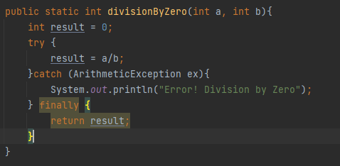

# Java Reserved Words
#### January 27, 2022

*Author: Gabriel Kiprono*

---

#### Modifiers

- **public**: code is accessible for all classes
- **private**: code is accessible only within the declared class
- **protected**: code is accessible within the same package and subclasses.
- **static**: static methods and attributes belong to class rather than instance objects
- **final**: final variable cannot be reassigned, final class cannot be inherited and final method cannot be overriden.
- **abstract**: abstract classes cannot be instantiated, but can be inherited.
- **synchronized**: methods can only be accessed by one thread at a time
- **native**: used to indicate that method is implemented in native code using JNI engine.
- **strictfp**: used in java for restricting floating point calculations and ensuring same result
- **transient**: attributes and methods are skipped when serializing an object containing them.
- **volatile**: value of an attribute is not cached locally, and is always read from the main memory

#### Flow control

- **break**: used to exit the loop immediately.
- **case**: conditional label which is used with the switch statement.
- **continue**: used to break one iteration and proceed to next.
- **default**: used to specify the default case in the switch case statement when no case has been matched.
- 
#### Exception handling

- **try**: used to define a block of code to be tested for errors
- **throw**: used to explicitly throw an exception from a method or code., custom error
- **throws**: used in the signature of the method to indicate this method might throw an exception.
- **catch**: used to define block of code to be executed if errors occur
- **finally**: used to define block of code to be executed irrespective of error
- **assert**: used to declare an expected condition in a program, mostly in unit tests

    

#### Class related keywords
- **package**: creates a collection of similar classes, i.e models package has all class files, creates a package
- **class**: used to declare new java class
- **import**: used to import package, class or interface.
- **extend**: indicates that class inherited from another class
- **implement**: used to implement the interface, add logic to empty methods.
- **interface**: is an abstract class used to group related methods with empty implementation.

#### Object related keywords
- **new**: used to create objects by assigning reference.
- **instanceOf**: used to check whether an object is an instance of specific class or an interface.
- **super**: refers to the parent class objects
- **this**: refers to the current object in a method or constructor

